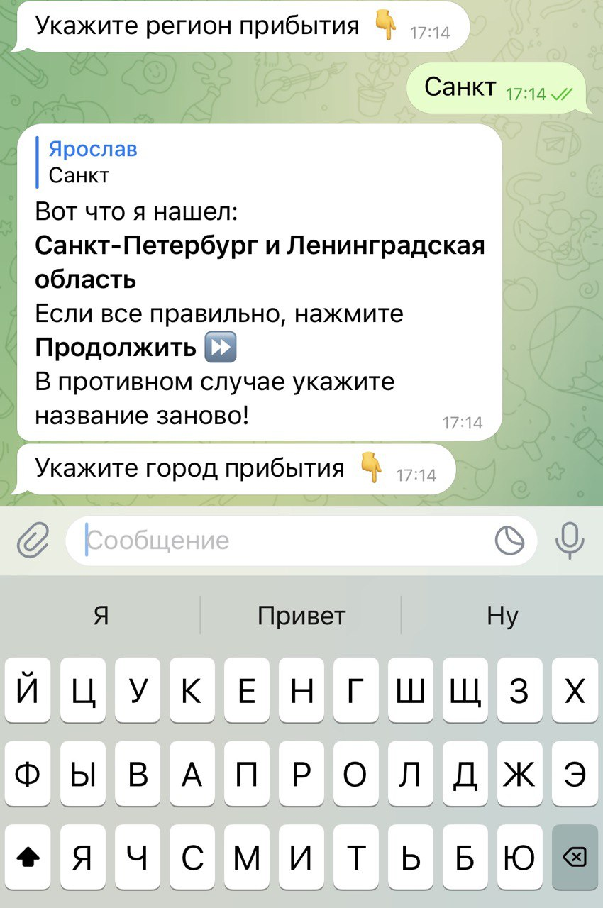

<h1 align="center">Yandex Timetable Bot</h1> 

<h2 align="center">Telegram bot in Python to provide information to the user about the routes and time of the movement of vehicles:</h2>
<h3 align="center">Aircraft, Trains, Buses</h3>

## Used software
[Aiogram](https://aiogram.dev/).
[Python](https://www.python.org/).
[Peewee](http://docs.peewee-orm.com/en/latest/).
[Loguru](https://loguru.readthedocs.io/en/stable/api/logger.html).

The bot works with API - [Yandex Timetables API.](https://yandex.ru/dev/rasp/)

## Beginning of work
### Basic steps to get the bot running:
1. Get the bot's **\<token\>**
2. Get and activate the Yandex Schedules API key (used in every API request)
3. Install dependencies from the [requirements. txt](python_basic_diploma/requirements.txt)
```
venv\Scripts\activate.bat - Windows;
source venv/bin/activate - Linux и MacOS.
```
```
pip install -r requirements.txt
```
4. Create a **.env** file in the root of the project and add:
```
TOKEN=
YANDEX_API_KEY=
```

## Bot project structure
- main.py (The file that contains the bot object)
- loader.py (Bot initialization)
- config.py (File with settings)
- requirements.txt (Libraries)
- api/ (Package - work with API)
- commands/ (Package - processing user commands)
- database/ (Package - working with the database)
- keyboard/ (Package - keyboard and buttons)

## Bot commands

### Team - Start
Starting the bot, displaying a greeting to the user and information about the interaction and commands of the bot.
- [/start, start, старт]()


#### Modules responsible for the work of the command:

```
commands/
    base_command.py
```

```python
async def information_bot(message: types.Message) -> None
```

### Command - help
Displays a list of bot commands.
- [/help]()


#### Modules responsible for the work of the command:

```
commands/
    base_command.py
```

```python
async def base_list_command(message: types.Message) -> None
```

### Command - history
Display the history of user requests
- [/history]()


#### Modules responsible for the work of the command:

```
commands/
    response_history.py
    
database/
    user_request_history/
                work_with_db.py
                
keyboard/
    response_history.py
```

### Team - Flight schedule between cities
The request allows you to get a list of transport flights from the specified city of departure to the specified city of arrival
and information for each flight.





#### Modules responsible for the work of the command:

```
commands/
    schedule_flights_between_cities.py
    
api/
    get_schedule_flights_between_cities.py
    
database/
    select_data_for_command/
                for_schedule_flights_between_cities.py
        
keyboard/
    schedule_between_cities_buttons.py
```

### Team - Schedule of flights by station
The request allows you to get a list of flights departing from the specified station and information on each flight.


#### Modules responsible for the work of the command:

```
commands/
    station_timetable.py
    
api/
    get_schedule_station.py
    
database/
    select_data_for_command/
                station_timetable.py
        
keyboard/
    station_timetable_buttons.py
```

### Command - List of nearest stations
The request allows you to get a list of stations located within the specified radius from the specified point.
The maximum number of stations returned is 30.
A point is defined by geographic coordinates (latitude and longitude)


#### Modules responsible for the work of the command:

```
commands/
    list_nearest_stations.py
    
api/
    get_list_nearest_stations.py
        
keyboard/
    list_nearest_buttons.py
```

### Command - List of stations in the locality
Displays a list of stations in the locality.
Used in the command - ***Schedule of flights by station***.
The maximum number of stations returned is 30.


```
commands/
    station_timetable.py
```
```python
response = await Select.list_station(settlement_code=c_code, transport=tr_code)
```
```
database/
    select_data_for_command/
                station_timetable.py 
```
```python
async def list_station(cls, settlement_code: str, transport: str) -> Optional[str]
```


